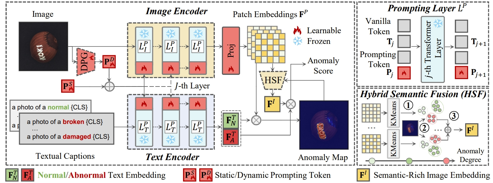
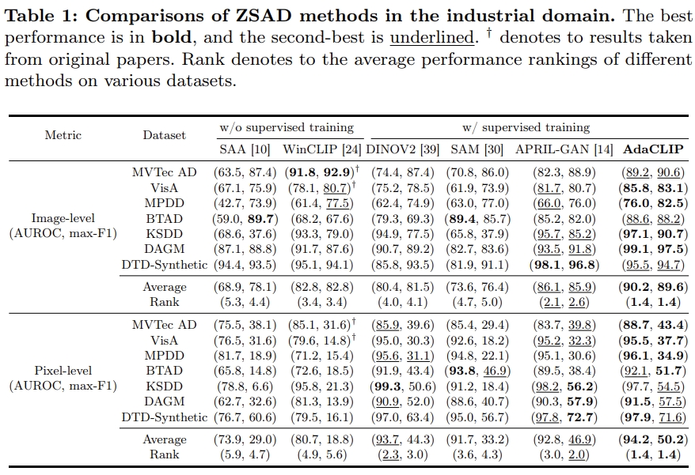
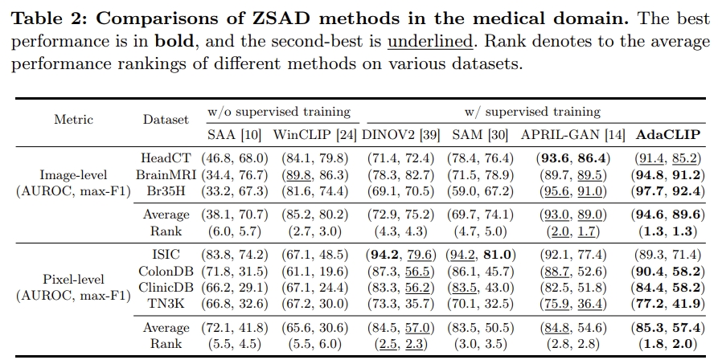
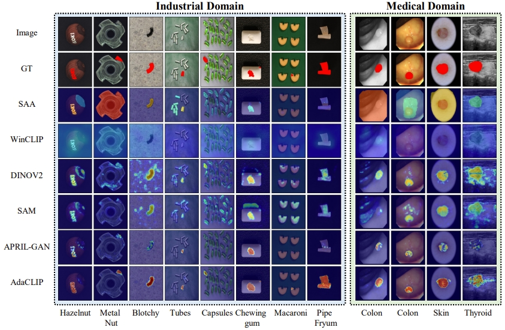
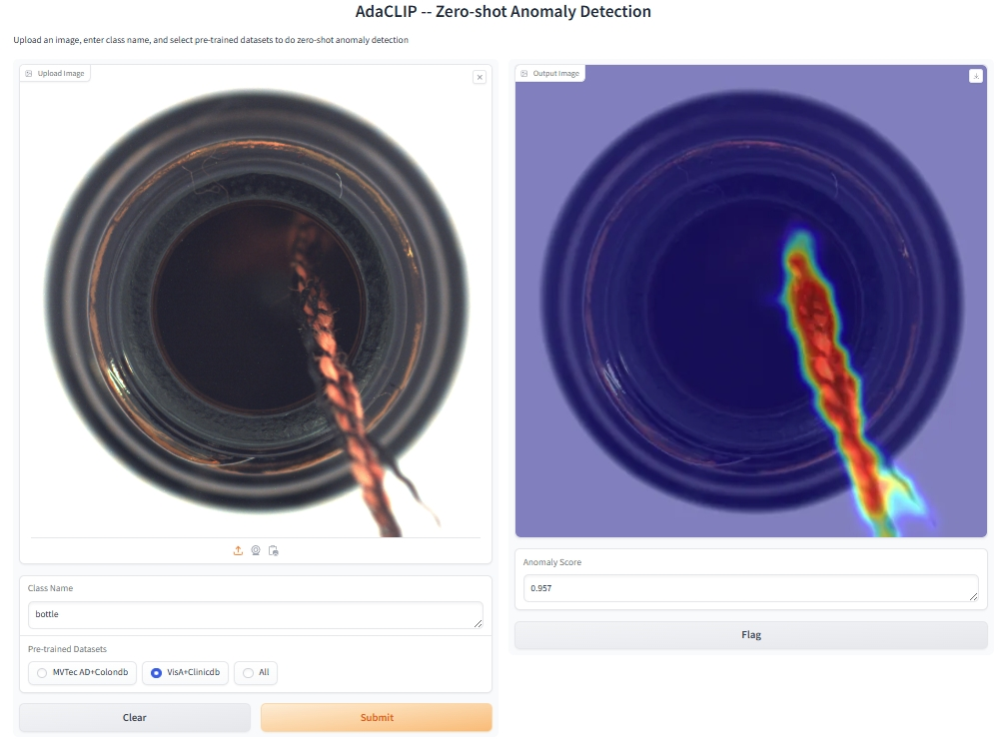

# AdaCLIP (Detecting Anomalies for Novel Categories)
[](https://huggingface.co/spaces/Caoyunkang/AdaCLIP)

> [**ECCV 24**] [**AdaCLIP: Adapting CLIP with Hybrid Learnable Prompts for Zero-Shot Anomaly Detection**]().
>
> by [Yunkang Cao](https://caoyunkang.github.io/), [Jiangning Zhang](https://zhangzjn.github.io/),  [Luca Frittoli](https://scholar.google.com/citations?user=cdML_XUAAAAJ), 
> [Yuqi Cheng](https://scholar.google.com/citations?user=02BC-WgAAAAJ&hl=en), [Weiming Shen](https://scholar.google.com/citations?user=FuSHsx4AAAAJ&hl=en), [Giacomo Boracchi](https://boracchi.faculty.polimi.it/) 
> 

## Introduction 
Zero-shot anomaly detection (ZSAD) targets the identification of anomalies within images from arbitrary novel categories. 
This study introduces AdaCLIP for the ZSAD task, leveraging a pre-trained vision-language model (VLM), CLIP. 
AdaCLIP incorporates learnable prompts into CLIP and optimizes them through training on auxiliary annotated anomaly detection data. 
Two types of learnable prompts are proposed: \textit{static} and \textit{dynamic}. Static prompts are shared across all images, serving to preliminarily adapt CLIP for ZSAD. 
In contrast, dynamic prompts are generated for each test image, providing CLIP with dynamic adaptation capabilities. 
The combination of static and dynamic prompts is referred to as hybrid prompts, and yields enhanced ZSAD performance. 
Extensive experiments conducted across 14 real-world anomaly detection datasets from industrial and medical domains indicate that AdaCLIP outperforms other ZSAD methods and can generalize better to different categories and even domains. 
Finally, our analysis highlights the importance of diverse auxiliary data and optimized prompts for enhanced generalization capacity.

## Overview of AdaCLIP


## 🛠️ Getting Started

### Installation
To set up the AdaCLIP environment, follow one of the methods below:

- Clone this repo:
  ```shell
  git clone https://github.com/caoyunkang/AdaCLIP.git && cd AdaCLIP
  ```
- You can use our provided installation script for an automated setup::
  ```shell
  sh install.sh
  ```
- If you prefer to construct the experimental environment manually, follow these steps:
  ```shell
  conda create -n AdaCLIP python=3.9.5 -y
  conda activate AdaCLIP
  pip install torch==1.10.1+cu111 torchvision==0.11.2+cu111 torchaudio==0.10.1 -f https://download.pytorch.org/whl/cu111/torch_stable.html
  pip install tqdm tensorboard setuptools==58.0.4 opencv-python scikit-image scikit-learn matplotlib seaborn ftfy regex numpy==1.26.4
  pip install gradio # Optional, for app 
  ```
- Remember to update the dataset root in config.py according to your preference:
  ```python
  DATA_ROOT = '../datasets' # Original setting
  ```

### Dataset Preparation 
Please download our processed visual anomaly detection datasets to your `DATA_ROOT` as needed. 

#### Industrial Visual Anomaly Detection Datasets
Note: some links are still in processing...

| Dataset | Google Drive | Baidu Drive | Task
|------------|------------------|------------------| ------------------|
| MVTec AD    | [Google Drive](链接) | [Baidu Drive](链接) | Anomaly Detection & Localization |
| VisA    | [Google Drive](链接) | [Baidu Drive](链接) | Anomaly Detection & Localization |
| MPDD    | [Google Drive](链接) | [Baidu Drive](链接) | Anomaly Detection & Localization | 
| BTAD    | [Google Drive](链接) | [Baidu Drive](链接) | Anomaly Detection & Localization |
| KSDD    | [Google Drive](链接) | [Baidu Drive](链接) | Anomaly Detection & Localization |
| DAGM    | [Google Drive](链接) | [Baidu Drive](链接) | Anomaly Detection & Localization |
| DTD-Synthetic    | [Google Drive](链接) | [Baidu Drive](链接) | Anomaly Detection & Localization |


#### Medical Visual Anomaly Detection Datasets
| Dataset | Google Drive | Baidu Drive | Task
|------------|------------------|------------------|  ------------------|
| HeadCT    | [Google Drive](链接) | [Baidu Drive](链接) | Anomaly Detection |
| BrainMRI    | [Google Drive](链接) | [Baidu Drive](链接) | Anomaly Detection |
| Br35H    | [Google Drive](链接) | [Baidu Drive](链接) | Anomaly Detection |
| ISIC    | [Google Drive](链接) | [Baidu Drive](链接) | Anomaly Localization |
| ColonDB    | [Google Drive](链接) | [Baidu Drive](链接) | Anomaly Localization |
| ClinicDB    | [Google Drive](链接) | [Baidu Drive](链接) | Anomaly Localization |
| TN3K    | [Google Drive](链接) | [Baidu Drive](链接) | Anomaly Localization |

#### Custom Datasets
To use your custom dataset, follow these steps:

1. Refer to the instructions in `./data_preprocess` to generate the JSON file for your dataset.
2. Use `./dataset/base_dataset.py` to construct your own dataset.


### Weight Preparation

We offer various pre-trained weights on different auxiliary datasets. 
Please download the pre-trained weights in `./weights`.

| Pre-trained Datasets | Google Drive | Baidu Drive 
|------------|------------------|------------------|  
| MVTec AD & ClinicDB    | [Google Drive](https://drive.google.com/file/d/1xVXANHGuJBRx59rqPRir7iqbkYzq45W0/view?usp=drive_link) | [Baidu Drive](链接) | 
| VisA & ColonDB    | [Google Drive](https://drive.google.com/file/d/1QGmPB0ByPZQ7FucvGODMSz7r5Ke5wx9W/view?usp=drive_link) | [Baidu Drive](链接) | 
| All Datasets Mentioned Above   | [Google Drive](https://drive.google.com/file/d/1Cgkfx3GAaSYnXPLolx-P7pFqYV0IVzZF/view?usp=drive_link) | [Baidu Drive](链接) |


### Train

By default, we use MVTec AD & ClinicDB for training and VisA for validation:
```shell
CUDA_VISIBLE_DEVICES=0 python train.py --save_fig True --training_data mvtec colondb --testing_data visa
```


Alternatively, for evaluation on MVTec AD & ClinicDB, we use VisA & ColonDB for training and MVTec AD for validation.
```shell
CUDA_VISIBLE_DEVICES=0 python train.py --save_fig True --training_data visa clinicdb --testing_data mvtec
```
Since we have utilized half-precision (FP16) for training, the training process can occasionally be unstable.
It is recommended to run the training process multiple times and choose the best model based on performance
on the validation set as the final model.


To construct a robust ZSAD model for demonstration, we also train our AdaCLIP on all AD datasets mentioned above:
```shell
CUDA_VISIBLE_DEVICES=0 python train.py --save_fig True \
--training_data \
br35h brain_mri btad clinicdb colondb \
dagm dtd headct isic mpdd mvtec sdd tn3k visa \
--testing_data mvtec
```

### Test

Manually select the best models from the validation set and place them in the `weights/` directory. Then, run the following testing script:
```shell
sh test.sh
```

If you want to test on a single image, you can refer to `test_single_image.sh`:
```shell
CUDA_VISIBLE_DEVICES=0 python test.py --testing_model image --ckt_path weights/pretrained_all.pth --save_fig True \
 --image_path asset/img.png --class_name candle --save_name test.png
```

## Main Results

Due to differences in versions utilized, the reported performance may vary slightly compared to the detection performance 
with the provided pre-trained weights. Some categories may show higher performance while others may show lower.





### :page_facing_up: Demo App

To run the demo application, use the following command:

```bash
python app.py
```

Or visit our [Online Demo](https://huggingface.co/spaces/Caoyunkang/AdaCLIP) for a quick start. The three pre-trained weights mentioned are available there. Feel free to test them with your own data!

Please note that we currently do not have a GPU environment for our Hugging Face Space, so inference for a single image may take approximately 50 seconds.



## 💘 Acknowledgements
Our work is largely inspired by the following projects. Thanks for their admiring contribution.

- [VAND-APRIL-GAN](https://github.com/ByChelsea/VAND-APRIL-GAN)
- [AnomalyCLIP](https://github.com/zqhang/AnomalyCLIP)
- [SAA](https://github.com/caoyunkang/Segment-Any-Anomaly)


## Stargazers over time
[](https://starchart.cc/caoyunkang/AdaCLIP)


## Citation

If you find this project helpful for your research, please consider citing the following BibTeX entry.

```BibTex

@inproceedings{AdaCLIP,
  title={AdaCLIP: Adapting CLIP with Hybrid Learnable Prompts for Zero-Shot Anomaly Detection},
  author={Cao, Yunkang and Zhang, Jiangning and Frittoli, Luca and Cheng, Yuqi and Shen, Weiming and Boracchi, Giacomo},
  booktitle={European Conference on Computer Vision},
  year={2024}
}

```
